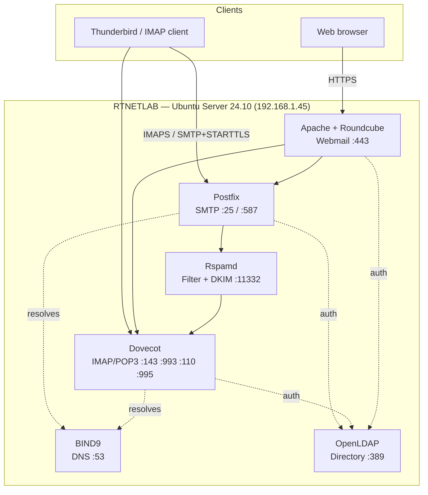
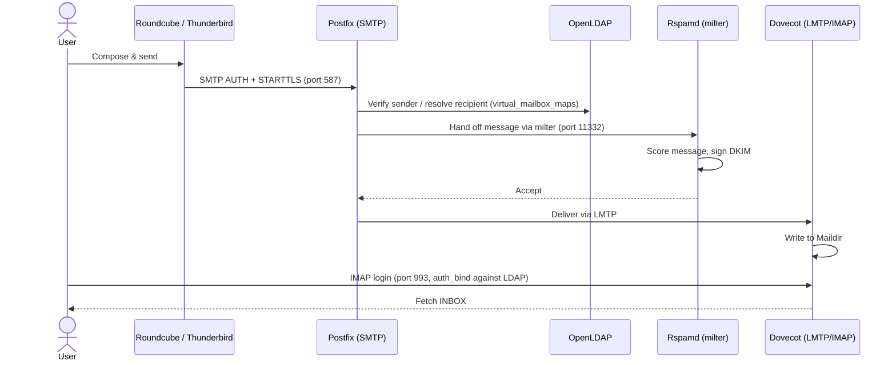

# RTNETLAB — Self-Hosted Secure Mail Infrastructure for Isolated Intranets

```
[RTNETLAB] boot sequence...
[OK] DNS resolving
[OK] SMTP / IMAP online
[OK] LDAP directory mounted
[OK] TLS handshake verified
[OK] SPF · DKIM · DMARC aligned
[DONE] mail is flowing.
```

**A complete, self-hosted enterprise-style email system — DNS, mail transport, directory services, webmail, encryption and anti-spoofing — designed, wired together, and tested end-to-end on a single Ubuntu Server intranet box.**


---

## Table of Contents

- [Why I Built This](#why-i-built-this)
- [What It Does](#what-it-does)
- [At a Glance](#at-a-glance)
- [Architecture](#architecture)
- [Tech Stack](#tech-stack)
- [How a Message Actually Moves Through the System](#how-a-message-actually-moves-through-the-system)
- [Security Model](#security-model)
- [Testing & Validation](#testing--validation)
- [Repository Structure](#repository-structure)
- [Reproducing the Lab](#reproducing-the-lab)
- [Skills Demonstrated](#skills-demonstrated)
- [Lessons Learned & What I'd Improve](#lessons-learned--what-id-improve)
- [Roadmap](#roadmap)
- [Full Report](#full-report)
- [About Me](#about-me)
- [License](#license)

---

## Why I Built This

Most people's first hands-on email experience is a managed inbox — Gmail, Outlook, whatever the company hands you. None of that tells you what's actually happening underneath: how a domain proves it owns its mail, how a message gets routed and rejected and signed, how a directory service becomes the single source of truth for every daemon on the box.

I wanted to build that stack myself, from an empty VM to a working, secured, testable mail platform — the way you'd stand up internal mail for a company that can't (or won't) trust its communications to a third party. No managed services, no shortcuts: DNS, transport, storage, directory, encryption and anti-spoofing, all configured, integrated, and verified by hand.

## What It Does

RTNETLAB is a fully self-hosted email platform for a closed network (`rtnetlab.lan`). Any user in the directory can:

- Log into a **web-based inbox** (Roundcube) or a **desktop client** (Thunderbird) over an encrypted connection
- Send and receive mail entirely within the intranet, resolved by an internal DNS zone
- Authenticate once against a **centralized LDAP directory** — no per-service accounts
- Trust that outgoing mail is **signed and policy-checked** (DKIM, SPF, DMARC, Rspamd scoring) the same way a real company domain would be

Every service is production-shaped: virtual mailboxes instead of local Unix users, LMTP delivery instead of local pipes, a milter-based filtering chain, and TLS on every listener that carries credentials.

## At a Glance

| | |
|---|---|
| **Environment** | VirtualBox VM · Ubuntu Server 24.10 · 2 vCPU · 4 GB RAM · Bridged networking |
| **Domain** | `rtnetlab.lan` — fully internal, resolved by a self-hosted BIND9 zone |
| **Services integrated** | DNS, SMTP, IMAP/POP3, LDAP, HTTP/S, mail filtering — 7 daemons, wired together |
| **Security layers** | TLS/SSL (self-signed, SAN), SASL auth, SPF, DKIM, DMARC, Rspamd scoring |
| **Full report** | 65-page, command-by-command build log — in French — see [`Secure_Mailing_Application_for_Intranet-RTNETLAB.pdf`](Secure_Mailing_Application_for_Intranet-RTNETLAB.pdf) |
| **Context** | Networks & Telecommunications engineering project — USTHB, Algeria |

## Architecture



Every arrow above is a protocol boundary configured and tested individually before the next one was wired in — DNS first, then transport, then storage, then directory, then encryption, then filtering. That order matters: you can't debug a SASL auth failure sanely if you're not sure DNS is resolving yet.

## Tech Stack

| Layer | Component | Role | Port(s) |
|---|---|---|---|
| OS | Ubuntu Server 24.10 | Base infrastructure | — |
| DNS | BIND9 | Internal zone `rtnetlab.lan`, MX/A records, SPF/DKIM/DMARC TXT records | 53 |
| MTA | Postfix | SMTP transport, submission, virtual mailbox routing | 25, 587 |
| MDA | Dovecot | IMAP/POP3 access, LMTP delivery, Maildir storage | 143, 993, 110, 995 |
| Directory | OpenLDAP (slapd) | Centralized accounts, POSIX attributes, mail routing source of truth | 389 |
| Filtering | Rspamd | Spam scoring, milter integration, DKIM signing, web dashboard | 11332, 11334 |
| Signing | OpenDKIM | Cryptographic signing of outgoing mail (milter) | 12301 |
| Webmail | Roundcube + Apache | Browser-based mail client over HTTPS, LDAP-backed login | 443 |
| Transport security | OpenSSL (self-signed, SAN) | TLS for SMTP/Submission/IMAPS/POP3S/HTTPS | — |
| Anti-spoofing | SPF, DKIM, DMARC | Sender authorization, message signing, policy enforcement | via DNS |
| Remote admin | OpenSSH | Secure server administration | 22 |

## How a Message Actually Moves Through the System



Nothing here is delivered to a local Unix mailbox — every account is virtual, resolved against LDAP at submission time and again at delivery time, the same pattern used by real multi-tenant mail platforms.

## Security Model

| Service | Port | Transport | Enforcement |
|---|---|---|---|
| SMTP (relay) | 25 | STARTTLS | Opportunistic — encrypts if the peer supports it |
| Submission | 587 | STARTTLS | **Mandatory** — SASL-authenticated clients only |
| IMAPS | 993 | Implicit TLS | Mailbox access always encrypted |
| POP3S | 995 | Implicit TLS | Mailbox access always encrypted |
| Webmail | 443 | HTTPS | Full session, including LDAP credentials, over TLS |

On top of transport encryption, outgoing mail carries three layers of domain-identity protection:

```
@   IN TXT "v=spf1 ip4:192.168.1.45 -all"
mail._domainkey IN TXT "v=DKIM1; h=sha256; k=rsa; p=..."
_dmarc IN TXT "v=DMARC1; p=none; rua=mailto:admin@rtnetlab.lan"
```

- **SPF** restricts which IP is allowed to claim `rtnetlab.lan` as a sender, rejecting trivial spoofing.
- **DKIM** cryptographically signs every outgoing message; the receiving side verifies it against the public key published above.
- **DMARC** ties SPF and DKIM into a policy the receiving server can act on, plus a reporting address for visibility into abuse attempts.

Rspamd sits in front of delivery as a milter, scoring every message and applying the DKIM signature before Dovecot ever sees it. Full configs for all of this are in [`configs/`](configs/).

## Testing & Validation

Every layer was verified independently before moving to the next — nothing was assumed to work.

| Layer | What was verified | Command |
|---|---|---|
| DNS | Zone resolves correctly | `dig @localhost rtnetlab.lan` / `nslookup rtnetlab.lan 127.0.0.1` |
| SMTP | Local mail accepted & delivered | `echo "msg" \| mail -s "subject" admin@rtnetlab.lan` |
| IMAP | Manual protocol-level session, login + fetch | `telnet rtnetlab.lan 143` → `a login … / a select INBOX / a fetch 1:*` |
| LDAP | Directory reachable, entries correct | `ldapsearch -x -b "dc=rtnetlab,dc=lan"` |
| Postfix ↔ LDAP | Recipient lookup resolves via directory | `postmap -q test@rtnetlab.lan ldap:/etc/postfix/ldap-users.cf` |
| TLS (Submission) | STARTTLS handshake, cert chain, cipher | `openssl s_client -starttls smtp -connect mail.rtnetlab.lan:587` |
| TLS (IMAPS/POP3S) | Implicit TLS handshake | `openssl s_client -connect mail.rtnetlab.lan:993` / `:995` |
| SPF | TXT record published correctly | `dig +short TXT rtnetlab.lan` |
| DKIM | Public key published, signature applied | `dig TXT mail._domainkey.rtnetlab.lan` + header inspection |
| DMARC | Policy record published | `dig TXT _dmarc.rtnetlab.lan` |
| Rspamd | Milter listening, dashboard reachable | `netstat -tulpn \| grep 12301` + web UI on `:11334` |
| End-to-end | Full send/receive via web UI | Login → compose → send → verify LMTP delivery + headers |

## Reproducing the Lab

The full report walks through every step with terminal output and screenshots; here's the shape of it:

1. **Environment** — VirtualBox VM, Ubuntu Server 24.10, static IP via Netplan, SSH access
2. **DNS** — BIND9 install, `rtnetlab.lan` zone, A/MX/NS records, resolution tests
3. **Mail transport** — Postfix (SMTP) + Dovecot (IMAP/POP3), tested with Mailutils and raw `telnet`
4. **Directory** — OpenLDAP install, schema, LDIF user provisioning, `ldapsearch` verification
5. **LDAP integration** — Postfix `virtual_mailbox_maps` + Dovecot `auth_bind`, Maildir creation confirmed
6. **Transport security** — self-signed SAN certificate, STARTTLS/implicit TLS on every listener
7. **Webmail** — Apache VirtualHost + Roundcube, LDAP-backed login, end-to-end send/receive
8. **Site vitrine** — a small static front page (`www.rtnetlab.lan`) linking into the webmail
9. **Mail security** — SPF, DKIM (OpenDKIM → Rspamd), DMARC, Rspamd scoring and dashboard

## Skills Demonstrated

**Networking** — TCP/IP, DNS zone design, SMTP/IMAP/POP3 protocol behavior, LDAP, HTTPS, protocol-level troubleshooting with `telnet`/`openssl s_client`

**Systems Administration** — Linux server deployment, service configuration and integration, SSH hardening, systemd service management, log-driven debugging

**Security Engineering** — TLS/SSL (cert generation, SAN, STARTTLS vs implicit TLS), SASL authentication, SPF/DKIM/DMARC design and verification, milter-based mail filtering

**Directory Services** — OpenLDAP schema design, POSIX account attributes, LDIF provisioning, using LDAP as a single source of truth across multiple daemons

**Mail Systems Architecture** — MTA/MDA separation, virtual mailbox routing, LMTP delivery, Maildir storage, webmail integration

**Testing & Validation** — protocol-level manual testing, not just "it loaded in the browser"; systematic layer-by-layer verification; reading and interpreting service logs

## Lessons Learned & What I'd Improve

- **Domain naming drifted mid-build.** Postfix was initially configured against `rtnetlab.local` before the project standardized on `rtnetlab.lan` for the DNS zone. Fixed in the configs here — 
- **DKIM ended up signed twice** — once via OpenDKIM, later via Rspamd's built-in signer. Functionally fine, but redundant; a cleaner build picks one and removes the other.
- **Self-signed certificates work for a lab, not for production.** A real deployment needs its own internal CA (or ACME via an internal DNS-01 solver) so clients can validate the chain instead of clicking through warnings.
- **No infrastructure-as-code.** Every service was configured by hand over SSH — great for learning what each directive does, not yet reproducible with a single command.
- **Single point of failure.** One VM runs DNS, mail, directory, and web. Fine for a lab; a real intranet would split these across hosts for resilience.

## Roadmap

- [ ] Ansible playbook to make the whole stack reproducible from a clean VM
- [ ] Replace the self-signed cert with an internal CA (or ACME DNS-01)
- [ ] Consolidate DKIM signing into Rspamd only, retire OpenDKIM
- [ ] `fail2ban` on SSH, SMTP-AUTH, and IMAP login attempts
- [ ] Sieve filters for server-side mail rules
- [ ] Prometheus + Grafana for mail queue / auth failure monitoring
- [ ] DNSSEC on the internal zone
- [ ] Multi-domain support in Postfix/Dovecot/LDAP

## Full Report

The complete build — every command, every config file, every screenshot, 65 pages — is documented in [`Secure_Mailing_Application_for_Intranet-RTNETLAB.pdf`](Secure_Mailing_Application_for_Intranet-RTNETLAB.pdf).

📄 **The report is written in French.** This README is the English executive summary; the PDF is the full lab notebook.

## About Me

**Yahia Kemari** — Telecommunications Engineer (M2), USTHB, Algeria.
Interested in networks, infrastructure, cybersecurity, and automation.

- LinkedIn: https://www.linkedin.com/in/yahia-kemari/
- Email: contact.kemari.yahia@gmail.com

Open to opportunities in network engineering, systems/infrastructure administration, or security.

## License

Released under the [MIT License](LICENSE).

*Built as part of the Networks & Telecommunications curriculum at USTHB — Faculté de Génie Électrique — under the supervision of M. Hemis.*
